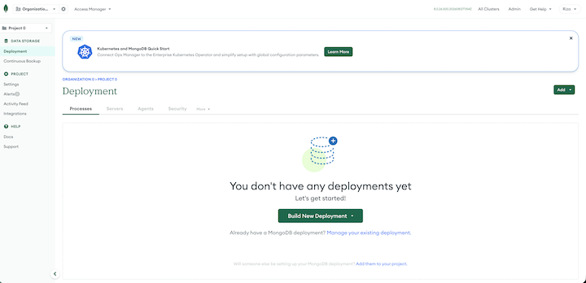

# Install a Test Ops Manager Deployment

This guide walks you through installing MongoDB Ops Manager and its Ops Manager Application Database on a single host, then preparing it to manage both a new deployment and an existing production replica set.

> ⚠️ **Testing / evaluation only — not a production configuration.**
> Everything in this project describes a single-host lab setup meant for learning and
> exercising Ops Manager features end to end. It deliberately skips the redundancy,
> security hardening, and separation of components that a production deployment requires:
> Ops Manager runs on one host with no high availability, the Application Database runs
> as a single `mongod` instead of a replica set, and several steps favor the simplest
> path over the safest one. **Do not copy this topology into production.** For a
> production install, follow the official
> [Ops Manager production installation](https://www.mongodb.com/docs/ops-manager/current/tutorial/install-on-prem-simple/)
> and [Ops Manager System Requirements](https://www.mongodb.com/docs/ops-manager/current/core/requirements/).

## Overview

You will provision the infrastructure, install the Ops Manager Application together with its Application Database on one host, and register the first user through the web console. The result is a working Ops Manager instance ready to host two projects: a new deployment you build from scratch and an existing production replica set you attach later.

This is a single-host test/evaluation setup: no failover, no high availability, and the Application Database runs as a single `mongod` rather than a dedicated replica set. Do not use this topology for a production Ops Manager. See the [official simple test installation guide](https://www.mongodb.com/docs/ops-manager/current/tutorial/install-simple-test-deployment/) and [Ops Manager System Requirements](https://www.mongodb.com/docs/ops-manager/current/core/requirements/) for reference.

## Infrastructure setup

Plan the virtual machines and network access before you install anything.

### Virtual machines

For this test setup you provision the following VMs. All run **RHEL 9.4 (64-bit)**.

| VM | Role | vCPU | RAM | Disk | Notes |
|----|------|------|-----|------|-------|
| `opsmgr-1` | Ops Manager Application + Application Database (single host) | 4+ | 16 GB | 100 GB on `/` | This guide. Hosts the web console and the backing `mongod`. |
| `new-1` | New MongoDB replica set nodes (Project A) | 2+ | 8 GB | 50 GB+ | Empty nodes. Ops Manager automation deploys MongoDB here (later guide). |
| `new-2` | New MongoDB replica set nodes (Project A) | 2+ | 8 GB | 50 GB+ | Empty nodes. Ops Manager automation deploys MongoDB here (later guide). |
| `new-3` | New MongoDB replica set nodes (Project A) | 2+ | 8 GB | 50 GB+ | Empty nodes. Ops Manager automation deploys MongoDB here (later guide). |

Notes on sizing for `opsmgr-1`:

- **RAM**: the Ops Manager Application needs 15 GB. Allocate at least 16 GB since the Application Database `mongod` also runs on this host in the test setup.
- **Disk**: allow 10 GB for the Ops Manager Application in `/opt`, plus space for logs (roughly 30 GB per month of logs you keep), plus the Application Database data. 100 GB on `/` is a safe starting point for testing.
- **`/tmp`**: keep at least 20 GiB free in `/tmp`, or Ops Manager warns and may misbehave.
- **CPU**: 4+ cores is enough for up to 400 monitored hosts.

The existing **production replica set (Project B)** is not provisioned here — it already exists. You only need network reachability to it (see below) so the MongoDB Agent can be attached in a later guide.

### Hostnames (FQDN)

Every Ops Manager, Agent, and MongoDB host should self-identify by its fully qualified domain name. Confirm the FQDN on each host:

```bash
hostname -f
```

The result should look like `opsmgr-1.example.dev`. If you do not run DNS, add an entry for every host to `/etc/hosts` on each machine:

```text
127.0.0.1     localhost
10.15.0.5     opsmgr-1.example.dev
10.15.10.15   new-1.example.dev
10.15.10.16   new-2.example.dev
10.15.10.17   new-3.example.dev
```

Replace the IPs and domain with your own values.

### Who connects (actors)

The port table below refers to three kinds of actors:

- **DBA** — uses Ops Manager through the browser (the web console, to provision,
  monitor, and manage backups).
- **infra engineer** — needs operating-system access to the hosts over SSH to install,
  configure, and troubleshoot at the OS level.
- **MongoDB Agent** — a non-human process running on each managed MongoDB host that
  connects to Ops Manager to report status and apply automation.

### Ports and firewall

Open these ports. The **From → To** column names the source and destination host for
each connection, so you can apply the rule on whichever host's firewall you are
configuring.

| Port | Transport | From → To | Purpose |
|------|-----------|-----------|---------|
| 8080 | TCP | DBA, Agents → `opsmgr-1` | Ops Manager web console (HTTP). |
| 8443 | TCP | DBA, Agents → `opsmgr-1` | Ops Manager web console (HTTPS, if TLS enabled). |
| 22 | TCP | infra engineer → all hosts | SSH administration. |
| 27017 | TCP | `opsmgr-1` → each managed MongoDB host | Ops Manager connects to the Application Database and to managed MongoDB (new + production) processes. |
| 27017 | TCP | new node ↔ new node | Replica set members talk to each other for replication and elections. Must be open **both ways** between all new nodes. |
| 587 | TCP | `opsmgr-1` → SMTP host | Send alert and account-recovery email. |

Additional ports depending on features you enable later:

- **Backup to a file-system / appliance target**: `2049/TCP` (NFS) outbound, or `443/TCP` outbound for an S3-compatible target, plus `25999/TCP` outbound to query the snapshot host. Confirm which the Dell PowerProtect DD target exposes before configuring backup.
- **Queryable backups**: `27700-27719/TCP` inbound to the Ops Manager host.
- **LDAP/Kerberos auth**: `389/UDP` (LDAP), `636/UDP` (LDAPS), `88 TCP/UDP` (Kerberos) as applicable.
- **KMIP encryption key management**: `5696/TCP` outbound.

Connectivity summary:

- Every managed MongoDB host (new and production) must reach `opsmgr-1` on 8080/8443 so its Agent can report in.
- `opsmgr-1` must reach each managed `mongod`/`mongos` on 27017.
- New nodes must reach **each other** on 27017 — they form a replica set, so every node connects to every other node for replication and elections.

### Internet access for binaries

To let Ops Manager download MongoDB binaries directly, allow HTTPS access from `opsmgr-1` to:

- `downloads.mongodb.com`, `downloads.mongodb.org` — MongoDB Enterprise builds
- `opsmanager.mongodb.com` — MongoDB version manifest
- `fastdl.mongodb.org` — MongoDB Community builds

If the host is air-gapped, configure Local Mode instead (out of scope for this guide).

## Prerequisites

- A VM `opsmgr-1` provisioned per the table above: **RHEL 9.4**, 4+ vCPU, 16 GB RAM, 100 GB on `/`.
- `root` (or `sudo`) access on the host.
- Bash 4.2 or later (default on RHEL 9).
- A MongoDB account to download the Ops Manager and MongoDB **Enterprise** packages.

Verify memory and storage before you begin:

```bash
vmstat -S M -s | grep "total memory"
```

```bash
df -h | grep "/$"
```

The first command reports total RAM in MB; the second reports capacity of the root filesystem. Confirm both meet the requirements above.

## Steps

Run every step in this section on `opsmgr-1`. This guide only installs Ops Manager and
its Application Database on that single host. You do not install anything on the
new nodes here — Ops Manager pushes MongoDB to them later through automation, in
a separate guide.

### 1. Enable time synchronization (NTP)

Every host (Ops Manager, new nodes, and the production nodes) must keep its
clock synchronized. Replica set elections, oplog timestamps, monitoring metrics,
point-in-time restore, and database audit logs all depend on accurate, consistent
time across hosts. On RHEL 9, time sync is handled by `chronyd`.

Install (if needed), enable, and start the service:

```bash
sudo dnf install -y chrony
```

```bash
sudo systemctl enable --now chronyd
```

Confirm the clock is synchronized:

```bash
timedatectl
```

The output should show `System clock synchronized: yes` and `NTP service: active`.

Apply this step to the new and production nodes too, not just `opsmgr-1`.

### 2. Add the MongoDB Enterprise package repository

Create the file `/etc/yum.repos.d/mongodb-enterprise-8.0.repo` so you can install MongoDB Enterprise with `dnf`:

```ini
[mongodb-enterprise-8.0]
name=MongoDB Enterprise Repository
baseurl=https://repo.mongodb.com/yum/redhat/$releasever/mongodb-enterprise/8.0/$basearch/
gpgcheck=1
enabled=1
gpgkey=https://pgp.mongodb.com/server-8.0.asc
```

This project uses **MongoDB Enterprise** binaries for every scenario (required for database auditing and other enterprise features), so the Application Database also uses Enterprise here.

### 3. Install MongoDB Enterprise

Install the latest 8.0 Enterprise release, which the Application Database uses:

```bash
sudo dnf install -y mongodb-enterprise
```

### 4. Make sure nothing else is using port 27017

The `mongodb-enterprise` package ships a systemd service unit named `mongod`
(`/usr/lib/systemd/system/mongod.service`). You will run the Application Database
through **that unit** in step 7, because it already applies MongoDB's recommended
resource limits (open files, processes) for you. Do not disable or mask it.

Ops Manager connects to its Application Database on port `27017`, so make sure no other
`mongod` is already running and holding that port. Check for a running process:

```bash
pgrep -ax mongod
```

If a `mongod` from an earlier attempt is running (for example one started by hand), stop
it before continuing so it does not conflict with the service you start in step 7:

```bash
sudo pkill -x mongod
```

If nothing is printed by `pgrep`, there is no conflict and you can continue.

### 5. Create the Application Database data directory

Create the data directory and give ownership to the `mongod` user:

```bash
sudo mkdir -p /data/appdb
```

```bash
sudo chown -R mongod:mongod /data
```

### 6. Configure the Application Database

The installer creates a configuration file at `/etc/mongod.conf`. Open it in your preferred text editor and set the following:

```yaml
systemLog:
  destination: file
  path: "/data/appdb/mongodb.log"
  logAppend: true
storage:
  dbPath: "/data/appdb"
  wiredTiger:
    engineConfig:
      cacheSizeGB: 1
processManagement:
  timeZoneInfo: /usr/share/zoneinfo
  pidFilePath: /var/run/mongodb/mongod.pid
net:
  bindIp: 127.0.0.1
  port: 27017
setParameter:
  enableLocalhostAuthBypass: false
```

Save the file when done.

### 7. Start the Application Database with systemd

Start `mongod` through the systemd unit that came with the package, and enable it so the
Application Database comes back automatically after a reboot:

```bash
sudo systemctl enable --now mongod
```

Using the service unit (instead of launching `mongod` by hand) matters for two reasons:

- **Resource limits are correct.** The unit sets `LimitNOFILE=64000` and
  `LimitNPROC=64000` — MongoDB's recommended limits. A hand-started `mongod` instead
  inherits your login shell's limits, which on RHEL default to only `1024` open files.
  That is far too low for the Application Database (Ops Manager stores its own logs there
  as many daily collections), and it makes `mongod` hit "Too many open files" and crash
  with a WiredTiger `WT_PANIC` once enough `.wt` files are open.
- **It survives reboots.** With `enable`, the Application Database starts on boot instead
  of leaving Ops Manager without its backing database.

Confirm `mongod` is running and listening on `127.0.0.1:27017`:

```bash
sudo systemctl status mongod --no-pager
```

```bash
sudo ss -tlnp | grep 27017
```

### 8. Raise the process limit for the Ops Manager user

RHEL caps user processes at 1024, which is too low for Ops Manager. Raise it for the
`mongodb-mms` user (the account Ops Manager runs as) by creating the file
`/etc/security/limits.d/99-mongodb-nproc.conf` containing these two lines:

```text
mongodb-mms soft nproc 200000
mongodb-mms hard nproc 500000
```

These lines are the **contents of the file**, not shell commands. Create the file in one
step with `tee`:

```bash
printf 'mongodb-mms soft nproc 200000\nmongodb-mms hard nproc 500000\n' | sudo tee /etc/security/limits.d/99-mongodb-nproc.conf
```

Verify the file contains the two lines:

```bash
cat /etc/security/limits.d/99-mongodb-nproc.conf
```

The limit applies to `mongodb-mms` processes started after the file exists, so this takes
effect before you install and start Ops Manager in the next steps.

### 9. Download the Ops Manager package

Get the exact installer URL from the [Ops Manager release archive](https://www.mongodb.com/try/download/ops-manager/releases/archive). Find the release you want (for example the latest 8.0), and under the Red Hat / RHEL row, right-click the **rpm** link and copy it. The archive links are direct downloads to `downloads.mongodb.com` and do not require the email form on the main download-center page.

The RPM lives under `https://downloads.mongodb.com/on-prem-mms/rpm/` and the file name
includes a build stamp you cannot guess — always copy the real link. For example, Ops
Manager 8.0.26 is:

```text
https://downloads.mongodb.com/on-prem-mms/rpm/mongodb-mms-8.0.26.500.20260812T1154Z.x86_64.rpm
```

> **Do not type a version by hand.** The build stamp (`.500.20260812T1154Z`) is
> release-specific. A made-up version downloads a tiny XML error page instead of the RPM,
> and `rpm -ivh` then fails with "not an rpm package".

**Option A — download directly on `opsmgr-1` (recommended if the host has internet).**
SSH into `opsmgr-1` and pull the installer straight to it using the link you copied:

```bash
curl -OL "https://downloads.mongodb.com/on-prem-mms/rpm/mongodb-mms-8.0.26.500.20260812T1154Z.x86_64.rpm"
```

- Use the current release's link, not the example above, unless it matches.
- `-O` keeps the remote file name; `-L` follows redirects.
- **Verify the download is a real RPM before installing** — a failed download is often a
  small XML/HTML error page, not the package:

  ```bash
  file mongodb-mms-*.x86_64.rpm
  ```

  It should report something like `RPM v3.0 bin` and be hundreds of MB. If it says XML or
  HTML (a few hundred bytes), the URL was wrong — recopy the link from the archive.

This avoids downloading locally and copying over. Skip step 10 if you use this.

**Option B — download elsewhere via the browser.** On the download center:

1. From the **Platforms** drop-down, choose the Red Hat / RHEL option that covers RHEL 9.
2. From the **Packages** drop-down, choose **RPM**.
3. Click **Download**.

Then copy it to the host (step 10).

### 10. Copy the installer to the host (only if you used Option B)

If you downloaded the installer elsewhere — for example because `opsmgr-1` is air-gapped —
copy it to the host with `scp`:

```bash
scp -i <keyfile> mongodb-mms-<version>.x86_64.rpm <username>@<opsmgr-host>:~
```

- `<keyfile>` — path to your SSH private key.
- `<version>` — the Ops Manager version in the package name.
- `<username>` and `<opsmgr-host>` — the login user and hostname/IP of `opsmgr-1`.

### 11. Install the Ops Manager package

Install the `.rpm` package. Use the actual file name you downloaded — type
`mongodb-mms-` and press Tab to autocomplete it rather than typing the version by hand:

```bash
sudo rpm -ivh mongodb-mms-<version>.x86_64.rpm
```

For example, for Ops Manager 8.0.26:

```bash
sudo rpm -ivh mongodb-mms-8.0.26.500.20260812T1154Z.x86_64.rpm
```

If you have not already, confirm the file is a real RPM first (a failed download is often
a small XML/HTML error page, which makes `rpm` report "not an rpm package"):

```bash
file mongodb-mms-*.x86_64.rpm
```

This installs Ops Manager under `/opt/mongodb/mms/`, creates the `mongodb-mms` system user that owns the Ops Manager processes, and writes the configuration file `/opt/mongodb/mms/conf/conf-mms.properties`. Leave the default Application Database connection string (`localhost:27017`) as is.

### 12. Start Ops Manager

Start the Ops Manager service through systemd:

```bash
sudo systemctl start mongodb-mms
```

The first startup takes a few minutes (the JVM starts and Ops Manager migrates its
schema in the Application Database), so port 8080 will not listen immediately. Watch
progress with:

```bash
sudo tail -f /opt/mongodb/mms/logs/mms0.log
```

Ops Manager is ready once it stops logging startup work and the port is listening:

```bash
sudo ss -tlnp | grep 8080
```

**If the console never comes up, check the Application Database first.** Ops Manager
cannot start without it, and the tell-tale sign is repeated `Connection refused` to
`127.0.0.1:27017` in `mms0.log`. Confirm the Application Database `mongod` you started in
step 7 is running and listening:

```bash
sudo systemctl status mongod --no-pager
```

```bash
sudo ss -tlnp | grep 27017
```

If `mongod` is not running, start it again, then restart Ops Manager so it reconnects:

```bash
sudo systemctl start mongod
```

```bash
sudo systemctl restart mongodb-mms
```

Because you started `mongod` through systemd with `enable` in step 7, the Application
Database comes back automatically after a reboot, and Ops Manager reconnects to it on its
own restart. If you ever see the `Connection refused` errors above, check `mongod` first.

### 13. Register the first user

1. Determine the hostname or IP of `opsmgr-1` (the FQDN you set earlier, e.g. `opsmgr-1.example.dev`).
2. In a browser, open Ops Manager:

   ```text
   http://<OpsManagerHost>:<Port>
   ```

   - `<OpsManagerHost>` — the hostname or IP of `opsmgr-1`.
   - `<Port>` — the Ops Manager port (default `8080`).
3. Click **Sign Up** and follow the prompts to register the first user and create the first organization and project. Ops Manager assigns the **Global Owner** role to this first user.

### 14. Complete the "Configure Ops Manager" wizard

After sign-up, Ops Manager shows a **Configure Ops Manager** page with many fields. Most
are optional; only a few matter for this test setup. Fill these:

- **URL to Access Ops Manager** — the address you reach the console at, including port.
  On the host, use the public DNS/IP:

  ```text
  http://<OpsManagerHost>:8080
  ```

  This becomes `mms.centralUrl`, which the MongoDB Agents use to find Ops Manager, so set
  it to an address the managed nodes can actually reach (not `localhost`).

- **Email addresses (required)** — Ops Manager requires **From**, **Reply To**, and
  **Admin** email addresses. It does not validate them, so placeholder values are fine
  for a test setup, e.g. `admin@example.com`.

**You do not need a real SMTP server.** Email delivery is required to *configure* but not
to *work* for our scenarios. Leave the email delivery method at its default and accept
the defaults:

- **Email Delivery Method** — leave as **SMTP Email Server**.
- **SMTP Server Hostname** — leave as `localhost`.
- **SMTP Server Port** — leave as `25`.
- **Username / Password** — leave blank (blank password disables SMTP auth).

Ops Manager saves this fine. It just won't actually send email (alerts, password resets), which does not matter for these guides.

Leave everything else (LDAP, SAML, OIDC, Twilio, KMIP, snapshot retention, etc.) at its
defaults. Click **Continue**.

### 15. Set the user authentication options

The next page covers **how users log in to the Ops Manager console** (you and your team).
This is authentication for the Ops Manager application itself — separate from the
authentication of the MongoDB databases it manages. For this test setup, accept the
defaults:

- **User Authentication Method** — leave **Application Database**. Ops Manager stores its
  login accounts in its own Application Database. The other options (LDAP, SAML, OIDC)
  need an external identity provider you do not have here, so do not select them.
- **Multi-factor Auth Level** — leave **OFF**. MFA is optional, and turning it on relies
  on working email or Twilio (which this test setup does not have).
- **Other Authentication Options** (password policy: failed attempts, expiry, reuse,
  etc.) — leave at defaults; all optional.

You do not need to fill anything in here — the first user you created at sign-up is stored
in the Application Database and is the Global Owner, so you log in with that account.
Continue.

> **These settings are not permanent.** Everything in this wizard (URL, email/SMTP, user
> authentication, MFA, and the pages below) is a global setting you can change later in
> the console under **Admin → General → Ops Manager Config**. Some also have equivalents
> in `conf-mms.properties`. So taking the defaults now is safe — you can switch to
> LDAP/SAML or enable MFA down the road without reinstalling.

### 16. Permissions / Usage Information Collection

The next page asks whether Ops Manager may collect generic usage information and send it
to MongoDB. This is a telemetry toggle — it does not affect functionality. Set it either
way based on your preference; leaving it at the default is fine for a test setup.
Continue.

### 17. Backup configuration defaults

The next page sets backup defaults: **Backup Snapshots**, **Backup Snapshot Schedule**,
**PIT (point-in-time) Restore**, and **Queryable Snapshot Configuration**. These are just
defaults for when you later enable backup — you are not enabling backup here.

For this test setup, **accept all the defaults and Continue**:

- Snapshot interval (default 24 hours) and retention (base/daily/weekly/monthly) — the
  defaults are fine; you can tune them per deployment later.
- PIT restore window (default 24 hours) — leave as is.
- Queryable Snapshot settings (ports, PEM file) — leave as is; these only apply if you
  use queryable backups.

Like the other pages, all of these are editable later under **Admin → General →
Ops Manager Config → Backup**. Continue.

### 18. Proxy, Twilio, version management, and alerts

The final wizard page groups a few more settings. All are optional for this test setup —
accept the defaults with these notes:

- **HTTP / HTTPS Proxy** — only needed if Ops Manager must go through a proxy to reach the
  internet. On a host with direct internet access, **leave these blank**.
- **Twilio Integration** — only for sending SMS / 2FA codes. You are not using SMS, so
  **leave it blank**.
- **MongoDB Version Management** (Installer Download Source) — leave at **remote** (the
  default), so Agents download MongoDB binaries from the internet. Keep this unless the
  host is air-gapped (then it would be `local` with manually supplied binaries).
- **Alerts** — leave the default alert configurations. You can tune alerts later, and you exercise alerting in `20-monitoring-new-and-alerting.md`.

All of these remain editable later under **Admin → General → Ops Manager Config**.
Continue to finish the wizard.

### 19. You reach the Deployment page

After the last page, the wizard is done and Ops Manager opens the **Deployment** page.
This is the home base of the console: from here you create and manage deployments, add
existing ones, and access monitoring, backup, and alerts. A fresh install looks like this,
with no deployments yet:



The installation guide ends here. From this page you can move on to the next scenarios —
for example provisioning a new replica set in `10-provision-new.md`.

## Verification

Confirm the setup works:

- The `mongod` process for the Application Database is running and listening on `127.0.0.1:27017`:

  ```bash
  sudo systemctl status mongod --no-pager
  ```

- The Ops Manager service is running:

  ```bash
  sudo systemctl status mongodb-mms --no-pager
  ```

- The Ops Manager web console loads at `http://<OpsManagerHost>:<Port>` and you can sign in with the first user you created.
- From the console, clicking **MongoDB Ops Manager** in the upper-left corner returns you to the Deployment page, where **Add** lets you deploy a MongoDB instance.

## Troubleshooting

- **Console does not load**: confirm the Ops Manager service started (`sudo systemctl status mongodb-mms --no-pager`) and that port 8080/8443 is reachable through any firewall or security group.
- **Ops Manager cannot reach the Application Database**: confirm `mongod` is running on `127.0.0.1:27017` and that you did not change the default connection string in `conf-mms.properties`.
- **Application Database crashes with "Too many open files" / `WT_PANIC`**: the `mongod`
  log shows `error 24` ("Too many open files") followed by a WiredTiger `WT_PANIC` and the
  process aborting. This means `mongod` is running with too low an open-files limit — the
  RHEL default of `1024`, which happens when `mongod` is started by hand from a shell
  instead of through systemd. Start it through the service unit, which sets
  `LimitNOFILE=64000`:

  ```bash
  sudo systemctl enable --now mongod
  ```

  Then confirm the limit took effect (**Max open files** should read `64000`):

  ```bash
  cat /proc/$(pgrep -x mongod)/limits | grep "Max open files"
  ```

- **Port conflict on 27017**: make sure no stray `mongod` is already running before you start the service (`pgrep -ax mongod`; see step 4).
- **Low `/tmp` warning**: ensure at least 20 GiB is free in `/tmp`.
- **Agent cannot connect later**: confirm the managed host can reach `opsmgr-1` on 8080/8443 and that `opsmgr-1` can reach the managed `mongod` on 27017.
